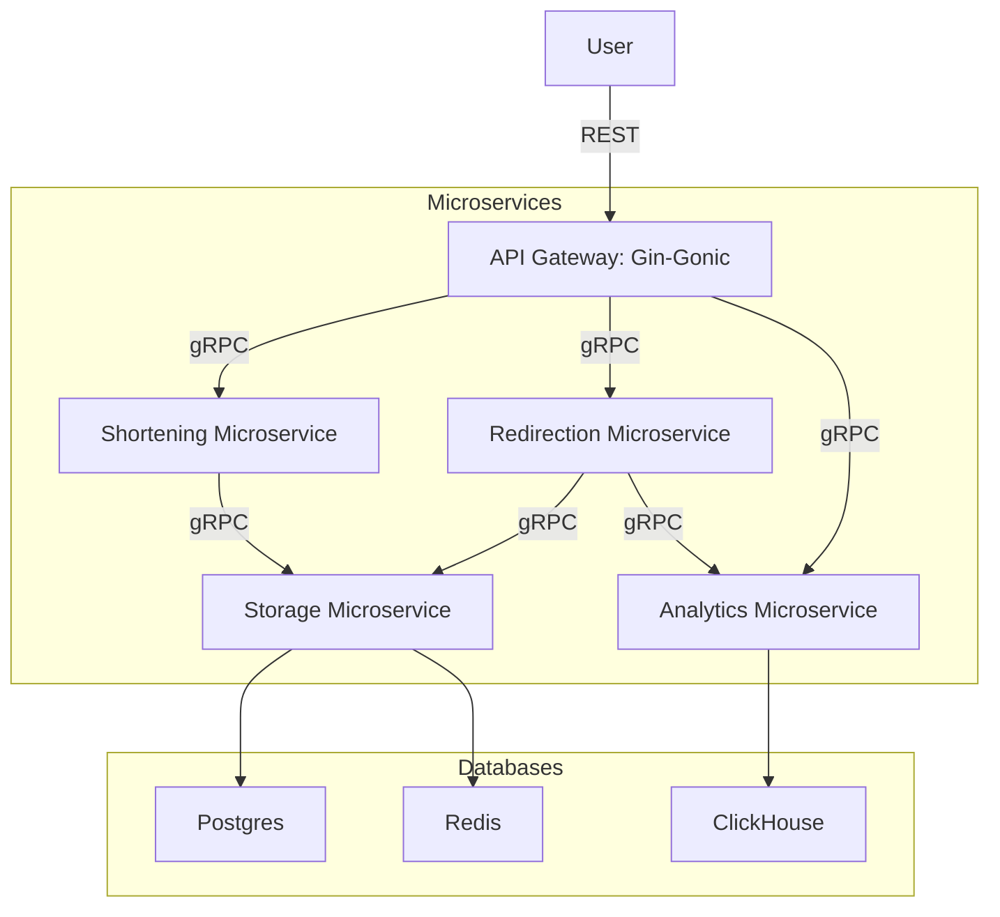

```mermaid
graph TD
    A[User] -->|REST| B[API Gateway: Gin-Gonic]
    B -->|gRPC| C[Shortening Microservice]
    B -->|gRPC| D[Redirection Microservice]
    C -->|gRPC| E[Storage Microservice]
    D -->|gRPC| E[Storage Microservice]
    D -->|gRPC| G[Analytics Microservice]
    E --> J[Postgres]
    G --> H[ClickHouse]
    E --> I[Redis]
    
    B -->|gRPC| G[Analytics Microservice]

    subgraph "Microservices"
        B
        C
        D
        E
        G
    end

    subgraph "Databases"
        I
        J
        H
    end

    
```
